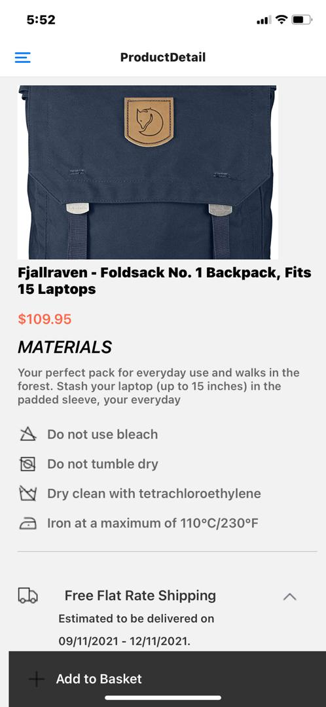

# rn-assignment7-11253585

#### Design Choices

1. **Navigation and Structure**:

   - **React Navigation**: Utilized `@react-navigation/drawer` for implementing a drawer navigator, offering easy access to various sections of the application.

   - **Component-based Architecture**: Separated concerns into different components (`CustomDrawerContent`, `Header`, `CartScreen`, `HomeScreen`, etc.) for maintainability and scalability.

   - **Responsive Design**: Ensured components like the drawer and header are styled for usability across various devices.

2. **Styling**:
   - **StyleSheet**: Used `StyleSheet` for defining component styles, promoting performance optimization and cleaner code.

   - **Consistent Theme**: Maintained a consistent look and feel across components with styles like `drawerHeader`, `userName`, `header`, etc.

3. **State Management**:
   - **useState and useEffect**: Employed React hooks for managing component states and side effects, enhancing the functional programming approach.

   - **AsyncStorage**: Leveraged `AsyncStorage` for persistent data storage, ensuring the cart data is retained across sessions.

4. **Data Fetching**:
   - **Axios**: Utilized `axios` for making API requests to fetch product data, ensuring a promise-based approach for handling asynchronous operations.

5. **User Experience**:
   - **TouchableOpacity**: Used `TouchableOpacity` for interactive elements, providing a native touch feedback on press.

   - **Alerts**: Implemented alerts for actions like adding items to the cart, enhancing user interaction feedback.

#### Implementation of Data Storage

1. **AsyncStorage**:
   - **Loading Cart Items**: On component mount, the `useEffect` hook retrieves cart items from `AsyncStorage` using `getItem`.

   - **Adding to Cart**: The `addToCart` function updates the cart state and stores the new cart array back to `AsyncStorage` using `setItem`.

   - **Removing from Cart**: The `removeFromCart` function filters out the removed item from the cart state and updates `AsyncStorage`.

2. **Persistent Storage Strategy**:
   - **Error Handling**: Incorporated try-catch blocks around async storage operations to catch and log errors, ensuring robustness.

   - **State Synchronization**: Ensured that updates to the cart are immediately reflected in both the state and `AsyncStorage`.

#### Screenshots

1. **Drawer Navigation**:
   - The drawer allows navigation to different sections like Home, Store, Locations, Blog, etc.
   - 

2. **Cart Screen**:
   - Displays items in the cart with an option to remove them and shows the total amount.
   - 

3. **Home Screen**:
   - Shows a list of products fetched from an API with options to add them to the cart.
   - 

4. **Product detail Screen**:
  - Preview a product selected from the Home Screen.
  - 

These design choices and implementation strategies ensure a robust, user-friendly application that adheres to best practices in React Native development.